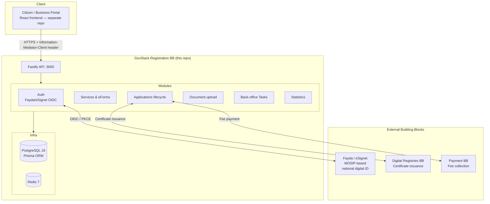
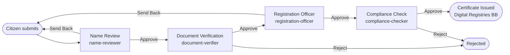
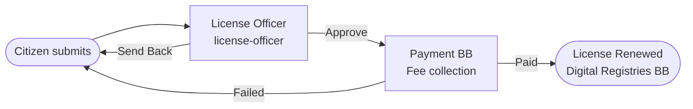
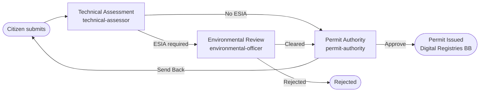

# govstack-bb-registration-et

[](https://github.com/AmanuelZ/govstack-bb-registration-et/actions/workflows/ci.yml)
[](https://opensource.org/licenses/MIT)
[](https://govstack.global)
[](https://digitalpublicgoods.net)

**Ethiopian reference implementation of the [GovStack Registration Building Block](https://govstack.gitbook.io/bb-registration) specification.**

---

## What This Is

This project is a production-grade Node.js/TypeScript backend that implements the GovStack Registration Building Block (BB) specification for the Federal Democratic Republic of Ethiopia. It demonstrates how digital public goods standards can be concretely applied within a national government context, serving as both a live reference system and a replicable template for other GovStack member states.

The system digitises three high-volume government registration workflows:

1. **Private Limited Company (PLC) formation** — Ministry of Trade and Regional Integration
2. **Annual Trade License renewal** — Ministry of Trade, with Ethiopian fiscal calendar awareness
3. **Manufacturing Permit issuance** — Ministry of Industry, with ESIA clearance for high-impact sectors

Each workflow implements the GovStack state machine model — from citizen application through multi-step back-office review to certificate issuance — with full bilingual support (Amharic and English), and integration with Ethiopia's national digital identity infrastructure (Fayda/eSignet).

As a GovStack reference implementation, this codebase is designed to be studied alongside the specification. Every significant architectural decision maps directly to a GovStack Cross-Functional Requirement (CFR), and the code is structured so that the mapping is navigable.

---

## Architecture



### Component Map

| Directory | Purpose |
|-----------|---------|
| `src/modules/` | Feature modules: services, eForms, applications, documents, tasks, statistics |
| `src/workflows/` | Ethiopian business rule determinants + workflow engine |
| `src/integrations/` | Fayda OIDC client, Payment BB, Digital Registries BB, IM types |
| `src/plugins/` | Fastify plugins: CORS, Swagger, rate-limit, auth routes, IM header |
| `src/common/` | Shared utilities: errors, audit, correlation IDs, logger |
| `src/config/` | Zod-validated environment config, Prisma client |
| `prisma/` | Schema (13 models), migrations, seed data |
| `mock-fayda/` | Local mock eSignet server for development |
| `helm/` | Kubernetes Helm chart |
| `docs/` | Architecture, workflow, integration, and compliance documentation |
| `test/features/` | Gherkin acceptance tests (GovStack BB compliance) |

---

## Ethiopian Workflows

### 1. Business Registration — Private Limited Company



Ministry of Trade and Regional Integration. Legal basis: Commercial Code of Ethiopia, Proclamation 1243/2021. Estimated: 5 business days.

Key rules: PLC minimum capital ETB 15,000; SC minimum 5 shareholders; OPPLC exactly 1 shareholder; high-capital surcharge > ETB 1M; sector-specific licenses (banking, media, etc.).

### 2. Trade License Renewal



Ministry of Trade. Annual renewal before Ethiopian fiscal year end (Pagume 5/6 ≈ Sept 10/11). Late penalty: 10% per 30-day period. Cancellation if > 6 months overdue. Estimated: 3 business days.

### 3. Manufacturing Permit



Ministry of Industry. ESIA Category A (full assessment) → B (limited) → C (self-declaration). Sector-specific: EFDA licence for food/pharma; water permit; EIC registration for large employers. Estimated: 14 business days.

---

## GovStack Compliance

| Requirement | Implementation |
|-------------|----------------|
| CFR 5.1.2 — Immutable audit trail | [src/common/audit.ts](src/common/audit.ts), `AuditLog` model |
| CFR 5.2 — Information Mediator header | [src/plugins/information-mediator.ts](src/plugins/information-mediator.ts) |
| CFR 5.3 — Correlation IDs | [src/common/correlation.ts](src/common/correlation.ts) |
| CFR 5.4 — Structured logging | [src/common/logger.ts](src/common/logger.ts) (Pino JSON) |
| CFR 5.5 — Privacy / PII | Fayda PSUT (no raw FIN), AES-256-GCM fields, redacted logs |
| CFR 5.6 — Fail-fast config validation | [src/config/index.ts](src/config/index.ts) (Zod) |
| CFR 5.7 — Health & readiness probes | `GET /api/v1/health`, `GET /api/v1/ready` |
| CFR 5.8 — OpenAPI documentation | Swagger UI at `/docs` |
| Reg BB 3.1 — Service catalogue | `GET /api/v1/services` |
| Reg BB 3.2 — Application lifecycle | `POST /api/v1/applications`, full status machine |
| Reg BB 3.3 — Workflow tasks | `POST /api/v1/tasks/:id/complete` |
| Reg BB 3.4 — Document management | `POST /api/v1/documents` (multipart) |
| Reg BB 3.5 — Fee integration | Payment BB client, `Fee` + `Payment` models |
| Reg BB 3.6 — Statistics | `GET /api/v1/statistics` |

Full compliance mapping: [docs/govstack-compliance.md](docs/govstack-compliance.md)

---

## Quick Start

### Prerequisites

- Docker and Docker Compose v2+
- Node.js 18+ (for local development without Docker)

### With Docker (recommended)

```bash
# Clone
git clone https://github.com/AmanuelZ/govstack-bb-registration-et.git
cd govstack-bb-registration-et

# Start all services (app + postgres + redis + mock-fayda)
docker compose up

# The app starts on port 3000 inside Docker
# API:     http://localhost:3000/api/v1/health
# Swagger: http://localhost:3000/docs
```

### Local development

```bash
# Install dependencies
npm install

# Copy and configure environment
cp .env.example .env
# Edit .env — set PORT, DATABASE_URL, REDIS_URL

# Start supporting services only
docker compose up postgres redis mock-fayda -d

# Push schema to database (first time)
npx prisma db push

# Seed reference data
npm run db:seed

# Start development server with hot reload
npm run dev
# API: http://localhost:3001/api/v1/health (default port 3001 in .env.example)
```

---

## API Documentation

Once running, interactive documentation is available at:

- **Swagger UI**: `http://localhost:3000/docs` (Docker) or `http://localhost:3001/docs` (local)
- **OpenAPI JSON**: `/docs/json`

All non-health endpoints require:
1. `Authorization: Bearer <jwt>` — obtained from `/api/v1/auth/login` → callback flow
2. `Information-Mediator-Client: ET/GOV/10000001/REGISTRATION` — GovStack IM header

See [docs/api-examples.md](docs/api-examples.md) for curl examples of every endpoint.

---

## Fayda Integration

[Fayda](https://fayda.et) is Ethiopia's MOSIP-based national digital identity system. [eSignet](https://esignet.io) provides the OIDC/OAuth2 authentication layer.

The integration uses:
- **Authorization Code Flow with PKCE** (RFC 7636) — prevents code interception
- **Pairwise Subject Tokens (PSUT)** — Fayda issues RP-specific `sub`; raw FIN never stored
- **ACR values**: `mosip:idp:acr:generated-code` (OTP) or `mosip:idp:acr:biometrics`

A mock eSignet server (`mock-fayda/`) starts automatically with `docker compose up` for local development.

Full guide: [docs/fayda-integration.md](docs/fayda-integration.md)

---

## Testing

```bash
# Run all tests
npm test

# Watch mode
npm run test:watch

# Coverage report
npm run test:coverage

# Run tests in Docker (isolated)
docker compose -f docker-compose.test.yml up --abort-on-container-exit
```

Tests use Vitest. The CI pipeline provisions real PostgreSQL and Redis via GitHub Actions services. See [docs/govstack-compliance.md](docs/govstack-compliance.md) for Gherkin acceptance test specifications.

---

## Deployment

### Docker Compose (development / staging)

```bash
docker compose up          # All services
docker compose up -d       # Detached
docker compose logs -f app # Stream app logs
```

### Kubernetes (Helm)

```bash
# Install with default values
helm install registration-bb-et ./helm/registration-bb-et \
  --namespace govstack \
  --create-namespace \
  --set image.tag=0.1.0

# Required secret
kubectl create secret generic registration-bb-et-secrets \
  --from-literal=DATABASE_URL="postgresql://..." \
  --from-literal=REDIS_URL="redis://..." \
  --from-literal=JWT_SECRET="<32+ chars>" \
  --from-literal=FAYDA_CLIENT_ID="..." \
  --from-literal=FAYDA_REDIRECT_URI="https://your-domain/api/v1/auth/callback" \
  --from-literal=FAYDA_ISSUER_URL="https://esignet.fayda.et"
```

See [helm/registration-bb-et/](helm/registration-bb-et/) for full Helm chart values.

---

## DPG Standard Compliance

The [Digital Public Goods Standard](https://digitalpublicgoods.net/standard/) requires:

- [x] **Open licence** — MIT (see [LICENSE](./LICENSE))
- [x] **Clear ownership** — Amanuel Zewdu Kebede
- [x] **Platform independence** — Docker, standard Node.js, PostgreSQL, Redis (no vendor lock-in)
- [x] **Documentation** — README, OpenAPI spec, architecture docs, integration guides
- [x] **Mechanism for extracting data** — REST API, Prisma migrations, structured JSON logs
- [x] **Adherence to privacy** — AES-256-GCM PII encryption, Fayda PSUT, Ethiopian Data Protection Proclamation 1038/2011 (see [PRIVACY.md](./PRIVACY.md))
- [x] **Adherence to security** — JWT auth, rate limiting, CORS, IM header validation, Zod input validation
- [x] **Standards & best practices** — GovStack BB spec v2.0, OpenAPI 3.0, ISO 8601, UUID identifiers

Full checklist: [docs/dpg-nomination.md](docs/dpg-nomination.md)

---

## Contributing

Please read [CONTRIBUTING.md](./CONTRIBUTING.md) before submitting a PR. All contributions must maintain GovStack BB spec alignment and include tests.

---

## Documentation

| Document | Description |
|----------|-------------|
| [docs/govstack-compliance.md](docs/govstack-compliance.md) | Requirement-by-requirement compliance mapping |
| [docs/ethiopian-workflows.md](docs/ethiopian-workflows.md) | Workflow logic and Ethiopian legal basis |
| [docs/fayda-integration.md](docs/fayda-integration.md) | Fayda/eSignet OIDC integration guide |
| [docs/api-examples.md](docs/api-examples.md) | curl examples for every endpoint |
| [docs/dpg-nomination.md](docs/dpg-nomination.md) | DPG Standard compliance checklist |
| [test/features/](test/features/) | Gherkin acceptance test specifications |

---

## Acknowledgments

- [GovStack Initiative](https://govstack.global) — Registration Building Block specification
- [MOSIP](https://mosip.io) — Open-source identity platform powering Fayda
- [eSignet](https://esignet.io) — OIDC layer for MOSIP
- Ethiopian Ministry of Trade and Regional Integration — workflow requirements
- [Digital Impact Alliance (DIAL)](https://dial.global) — DPG ecosystem

---

## License

MIT — see [LICENSE](./LICENSE)
